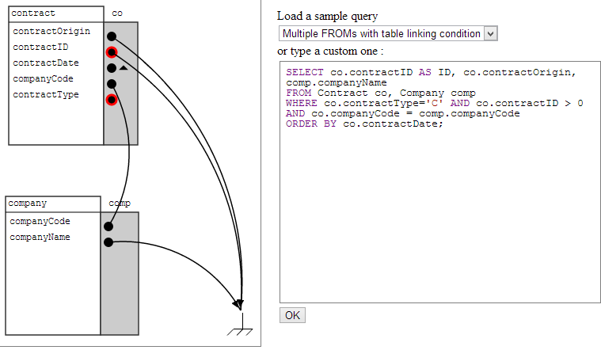

## squt (it's like SQL, but cUTe)

squt is a Perl and PHP/JS library aiming at graphically representing (My)SQL queries in a graph form.

squt uses :
* Philip Stoev's [MyParse](http://search.cpan.org/~philips/DBIx-MyParse/) to parse MySQL queries
* Mike Bostock's [d3](https://github.com/mbostock/d3.git) to handle the graph representation.
* Marijn Haverbeke's [CodeMirror](https://github.com/marijnh/CodeMirror) for the in-browser code editor
* Kevin Lindsey's [js-intersections](https://github.com/thelonious/js-intersections.git) for geometrical intersection calculations.
* jQuery's [qunit](https://github.com/jquery/qunit.git) and [qunit-reporter-junit](https://github.com/jquery/qunit-reporter-junit.git) along with PrettyCode's [Object.identical.js](https://github.com/prettycode/Object.identical.js.git) for testing purposes

All of them are integrated into squt as submodules : no need to install them manually.

Want to know more and install it ? Have a look at the [Installation guide](../../wiki/Installation Guide) !

... Or play with the online [demo](http://87.106.165.63/squt/master/front-end/squt.html) :-)

